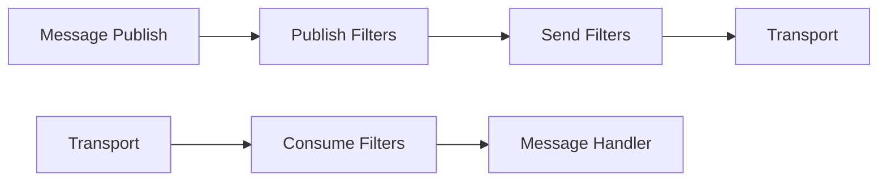
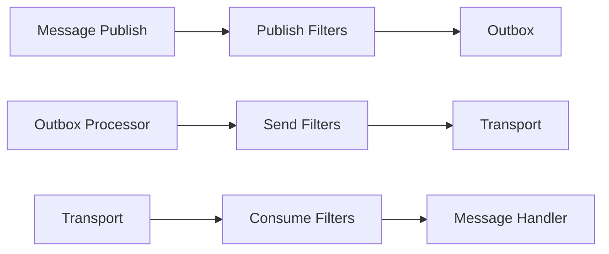

# Whispr Messaging Library

[](https://github.com/huysentruitw/Whispr/actions/workflows/build-test-publish.yml)

⚡A lightweight message bus implementation for Azure Service Bus with EF Core outbox.

Supports .NET 10 with EF Core 10.

See the [release notes](RELEASE_NOTES.md) for changes and upgrade instructions.

## 🚀 Example usage

```csharp
services
    .AddWhispr()
        .AddAzureServiceBusTransport(options =>
        {
            // Option 1: Use connection string authentication
            options.ConnectionString = "Endpoint=sb://your-namespace.servicebus.windows.net/;SharedAccessKeyName=...;SharedAccessKey=...";
            
            // OR
            
            // Option 2: Use host name with managed identity authentication
            options.HostName = "your-namespace.servicebus.windows.net";
        })
        .AddTopicNamingConvention<DefaultTopicNamingConvention>()
        .AddQueueNamingConvention<DefaultQueueNamingConvention>()
        .AddSubscriptionNamingConvention<MySubscriptionNamingConvention>()
        .AddMessageHandlersFromAssembly(Assembly.GetExecutingAssembly());
```

☝️ There is no default subscription naming convention, see [Azure Service Bus](#azure-service-bus) for an example implementation.

Whispr automatically starts listening for messages when the host starts, and gracefully stops during shutdown - no manual initialization required.

### Publishing a message

```csharp
public sealed class MyService(IMessagePublisher publisher)
{
    public async Task DoSomethingAsync(CancellationToken cancellationToken)
    {
        var message = new SomethingHappened
        {
            Id = Guid.NewGuid(),
            Timestamp = DateTime.UtcNow
        };

        await publisher.Publish(message, cancellationToken: cancellationToken);
        
        // When using the transactional outbox, save changes to the DbContext to ensure the message is added to the outbox
        // await dbContext.SaveChangesAsync(cancellationToken);
    }
}
```

☝️ Messages are routed and serialized by their runtime type, so a message published through a base type or interface (e.g. `Publish<IDomainEvent>(domainEvent)`) is delivered to the topic and handlers of its concrete type.

## 🏷️ Naming conventions

This library auto-generates topics and queues by using the given naming conventions. The default naming conventions are:

- `DefaultTopicNamingConvention`: `MyNamespace.SomethingHappened` -> `my-namespace--something-happened`
- `DefaultQueueNamingConvention`: `MyNamespace.SomethingHappenedHandler` -> `my-namespace--something-happened-handler`

To customize the naming conventions, implement the following interfaces:

```csharp
public sealed class MyTopicNamingConvention : ITopicNamingConvention
{
    public string Format(Type messageType) => $"topic-{messageType.Name}";
}
```

```csharp
public sealed class MyQueueNamingConvention : IQueueNamingConvention
{
    public string Format(Type handlerType) => $"queue-{handlerType.Name}";
}
```

and register them using:

```csharp
services
    .AddWhispr()
        .AddTopicNamingConvention<MyTopicNamingConvention>()
        .AddQueueNamingConvention<MyQueueNamingConvention>();
```

## 🧬 Serialization

Messages are serialized with `System.Text.Json`, using the default `JsonSerializerOptions`. To customize the options, e.g. to serialize enums as strings:

```csharp
services
    .AddWhispr()
        .ConfigureJsonSerializerOptions(options => options.Converters.Add(new JsonStringEnumConverter()));
```

> ⚠️ Publishers and consumers of a message must use compatible options, e.g. the same property naming policy. Changing the options also affects messages that are already in transit or in the outbox.

## 🚌 Transports

### In-memory

The in-memory transport is implemented in the base library and is used for testing purposes.

⚠️ It is not recommended for production use, this is not a MediatR replacement.

```csharp
services
    .AddWhispr()
        .AddInMemoryTransport();
```

☝️It is possible to combine the in-memory transport with the transactional outbox.

### Azure Service Bus

The Azure Service Bus transport is implemented using the `Azure.Messaging.ServiceBus` package. The transport can be configured using the `AddAzureServiceBusTransport` method:

```csharp
services
    .AddWhispr()
        .AddAzureServiceBusTransport(options =>
        {
            options.ConnectionString = "Endpoint=sb://...";
        });
```

Since this transport also creates subscriptions to forward messages from topics to queues, the subscription naming convention can be customized as well:

```csharp
public sealed class MySubscriptionNamingConvention : ISubscriptionNamingConvention
{
    public string Format(string queueName) => $"subscription-{queueName}";
}
```

and registered using:

```csharp
services
    .AddWhispr()
        .AddSubscriptionNamingConvention<MySubscriptionNamingConvention>();
```

The settings of the queues and topics created by Whispr can be customized as well, e.g. to use a shorter `AutoDeleteOnIdle` with the Azure Service Bus emulator. These settings are only applied when creating an entity, existing queues and topics are not updated.

```csharp
services
    .AddWhispr()
        .AddAzureServiceBusTransport(options =>
        {
            options.QueueCreation.AutoDeleteOnIdle = TimeSpan.FromHours(1);
            options.QueueCreation.DefaultMessageTimeToLive = TimeSpan.FromHours(1);
            options.TopicCreation.AutoDeleteOnIdle = TimeSpan.FromHours(1);
            options.TopicCreation.DefaultMessageTimeToLive = TimeSpan.FromHours(1);
        });
```

When a message handler throws, the message is abandoned and redelivered immediately, until `QueueCreation.MaxDeliveryCount` is reached and the message is dead-lettered. To prevent a short outage of an external dependency from dead-lettering messages right away, enable an exponential back-off by setting `RetryBackoffBase`. The delay then doubles with each delivery, capped at `RetryBackoffMax` (30 seconds by default).

```csharp
services
    .AddWhispr()
        .AddAzureServiceBusTransport(options =>
        {
            options.RetryBackoffBase = TimeSpan.FromSeconds(1);
            options.RetryBackoffMax = TimeSpan.FromSeconds(30);
        });
```

> ⚠️ While waiting, the message stays locked and occupies a `QueueConcurrencyLimit` slot of its queue.

☝️ A message with a type that isn't handled by the receiving handler is dead-lettered immediately with reason `Unsupported message type`. This typically happens when a handler no longer handles a message type, while its subscription on that topic still exists. Delete the stale subscription to stop these messages from arriving.

## 🪄 Filters

### Pipeline


```mermaid
flowchart LR
    A[Message Publish] --> B[Publish Filters] --> C[Send Filters] --> D[Transport]
    
    E[Transport] --> F[Consume Filters] --> G[Message Handler]
```

Three types of filters can be applied to the messaging pipeline:

- `IPublishFilter`: Filters that are applied when a message is published.
- `ISendFilter`: Filters that are applied before a message is sent to the transport.
- `IConsumeFilter`: Filters that are applied before the message is handled by the message handler.

### Dependency injection

Publish filters are executed from the same scope as from where the message is published.

Send filters are executed from a temporary scope and have no access to the original scope. This is by design to have a similar behavior with or without the transactional outbox.

Consume filters are executed from a temporary scope in which also the message handler is executed.

## 📬 Transactional Outbox

The transactional outbox pattern is implemented using EF Core and consists of:

- A scoped outbox that captures messages and adds them to the scoped DbContext.
- A background service that polls the outbox and sends messages to the transport.
- [OPTIONAL] A background service that removes processed messages from the outbox after a given retention period.

There is also a trigger mechanism that forces the outbox to be processed as soon as possible. This is useful when you want to ensure that messages are sent immediately after the transaction is committed.

> ⚠️ The query used by the outbox background service is currently implemented for MSSQL Server only, other databases are not supported.

Enabling the outbox is a two step process:

1. Add and configure the outbox using the `AddOutbox` extension method:

```csharp
services
    .AddWhispr()
        .AddOutbox<MyDbContext>(options =>
        {
            options.IdleQueryDelay = TimeSpan.FromSeconds(10);
            options.MaxMessageBatchSize = 100;
            options.EnableMessageRetention = true;
            options.ProcessedMessageRetentionPeriod = TimeSpan.FromDays(1);
            options.ProcessedMessageCleanupDelay = TimeSpan.FromHours(1);
            options.ProcessedMessageCleanupBatchSize = 100;
            options.MaxSendAttempts = null; // Never park messages
            options.RetryBackoffBase = TimeSpan.FromSeconds(1);
            options.RetryBackoffMax = TimeSpan.FromMinutes(5);
        });
```

2. Add the outbox to the DbContext:

```csharp
public class MyDbContext : DbContext
{
    public MyDbContext(DbContextOptions<MyDbContext> options) : base(options)
    {
    }

    protected override void OnModelCreating(ModelBuilder modelBuilder)
    {
        modelBuilder.AddOutboxMessageEntity(schemaName: "Application");
    }
}
```

3. Add an EF Core migration to create the outbox table.

### Retries and parked messages

When a send attempt fails, the message is retried with exponential backoff, starting at `RetryBackoffBase` and capped at `RetryBackoffMax`. Other messages are sent in the meantime, so a message that keeps failing never blocks the outbox. The number of failed send attempts and the last error are stored in the `AttemptCount` and `LastError` columns.

By default, a message is retried until it's sent. When `MaxSendAttempts` is set, a message is parked after that many failed send attempts, by setting `ParkedAtUtc`. Parked messages are no longer retried and are not removed by the cleanup service.

> ⚠️ A transport outage causes all send attempts to fail, so a low `MaxSendAttempts` can park a lot of messages.

To find parked messages and retry them:

```sql
SELECT * FROM [Application].[OutboxMessage] WHERE [ParkedAtUtc] IS NOT NULL;

UPDATE [Application].[OutboxMessage]
SET [ParkedAtUtc] = NULL, [AttemptCount] = 0, [NextAttemptAtUtc] = NULL
WHERE [ParkedAtUtc] IS NOT NULL;
```

### Pipeline with outbox


```mermaid
flowchart LR
    A[Message Publish] --> B[Publish Filters] --> C[Outbox]

    D[Outbox Processor] --> E[Send Filters] --> F[Transport]
    
    G[Transport] --> H[Consume Filters] --> I[Message Handler]
```

## Multi-bus support

It is possible to configure multiple named buses in the same application.

Configuration example:

```csharp
services
    .AddWhispr("ModuleA")
    ...

services
    .AddWhispr("ModuleB")
    ...
```

Each bus runs as its own hosted service and starts/stops automatically with the host.

> ⚠️ When using the transactional outbox, each bus requires its own `DbContext`. Registering the outbox with the same `DbContext` on multiple buses throws an `InvalidOperationException`.

Publish a message to a specific bus:

```csharp
public sealed class MyService([FromKeyedServices("ModuleA")] IMessagePublisher publisher)
{
    public async Task DoSomethingAsync(CancellationToken cancellationToken)
    {
        var message = new SomethingHappened
        {
            Id = Guid.NewGuid(),
            Timestamp = DateTime.UtcNow
        };

        await publisher.Publish(message, cancellationToken: cancellationToken);
        
        // When using the transactional outbox, save changes to the DbContext to ensure the message is added to the outbox
        // await dbContext.SaveChangesAsync(cancellationToken);
    }
}
```

> ☝️️ To avoid having to type `[FromKeyedServices("...")]` everywhere, create a wrapper publisher for each bus.
