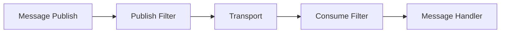
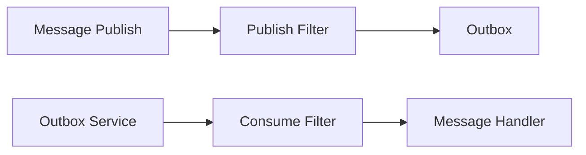

# Whispr Messaging Library

[](https://github.com/huysentruitw/Whispr/actions/workflows/build-test-publish.yml)

A lightweight message bus implementation for Azure Service Bus with EF Core outbox.

Supports .NET 8 with EF Core 8 and .NET 9 with EF Core 9.

## Example usage

```csharp
services
    .AddWhispr()
        .AddAzureServiceBusTransport(options =>
        {
            options.ConnectionString = "...";
        })
        .AddTopicNamingConvention<DefaultTopicNamingConvention>()
        .AddQueueNamingConvention<DefaultQueueNamingConvention>()
        .AddSubscriptionNamingConvention<SubscriptionNamingConvention>()
        .AddMessageHandlersFromAssembly(Assembly.GetExecutingAssembly());
```

## Naming conventions

This library auto-generates topics and queues by using the given naming conventions. The default naming conventions are:

- `DefaultTopicNamingConvention`: `MyNamespace.SomethingHappened` -> `my-namespace--something-happened`
- `DefaultQueueNamingConvention`: `MyNamespace.SomethingHappenedHandler` -> `my-namespace--something-happened-handler`

To customize the naming conventions, implement the following interfaces:

```csharp
public sealed class MyTopicNamingConvention : ITopicNamingConvention
{
    public string Format(Type messageType) => $"topic-{messageType.Name}";
}
```

```csharp
public sealed class MyQueueNamingConvention : IQueueNamingConvention
{
    public string Format(Type handlerType) => $"queue-{handlerType.Name}";
}
```

and register them using:

```csharp
services
    .AddWhispr()
        .AddTopicNamingConvention<MyTopicNamingConvention>()
        .AddQueueNamingConvention<MyQueueNamingConvention>();
```

## Transports

### In-memory

_TODO_

### Azure Service Bus

The Azure Service Bus transport is implemented using the `Microsoft.Azure.ServiceBus` package. The transport can be configured using the `AddAzureServiceBusTransport` method:

```csharp
services
    .AddWhispr()
        .AddAzureServiceBusTransport(options =>
        {
            options.ConnectionString = "Endpoint=sb://...";
        });
```

Since this transport also creates subscriptions to forward messages from topics to queues, the subscription naming convention can be customized as well:

```csharp
public sealed class MySubscriptionNamingConvention : ISubscriptionNamingConvention
{
    public string Format(Type handlerType) => $"subscription-{handlerType.Name}";
}
```

and registered using:

```csharp
services
    .AddWhispr()
        .AddSubscriptionNamingConvention<MySubscriptionNamingConvention>();
```

## Filters

Pipeline:



Two types of filters can be applied to the messaging pipeline:

- `IPublishFilter`: Filters that are applied when a message is published.
- `IConsumeFilter`: Filters that are applied before the message is handled by the message handler.

## Transactional Outbox

The transactional outbox pattern is implemented using EF Core and consists of:

- A scoped outbox that captures messages and adds them to the scoped DbContext.
- A background service that polls the outbox and sends messages to the transport.
- [OPTIONAL] A background service that removes processed messages from the outbox after a given retention period.

There is also a trigger mechanism that forces the outbox to be processed as soon as possible. This is useful when you want to ensure that messages are sent immediately after the transaction is committed.

> ⚠️ The query used by the outbox background service is currently implemented for MSSQL Server only. If you are using a different database, you will need to implement your own query.

Enabling the outbox is a two step process:

1. Add and configure the outbox using the `AddOutbox` extension method:

```csharp
services
    .AddWhispr()
        .AddOutbox(options =>
        {
            options.QueryDelay = TimeSpan.FromSeconds(10);
            options.MaxMessageBatchSize = 100;
            options.EnableMessageRetention = true;
            options.ProcessedMessageRetentionPeriod = TimeSpan.FromDays(1);
            options.ProcessedMessageCleanupDelay = TimeSpan.FromHours(1);
            options.ProcessedMessageCleanupBatchSize = 100;
        });
```

2. Add the outbox to the DbContext:

```csharp
public class MyDbContext : DbContext
{
    public MyDbContext(DbContextOptions<MyDbContext> options) : base(options)
    {
    }

    protected override void OnModelCreating(ModelBuilder modelBuilder)
    {
        modelBuilder.AddOutboxMessageEntity(schemaName: "Application");
    }
}
```

Pipeline with outbox:



